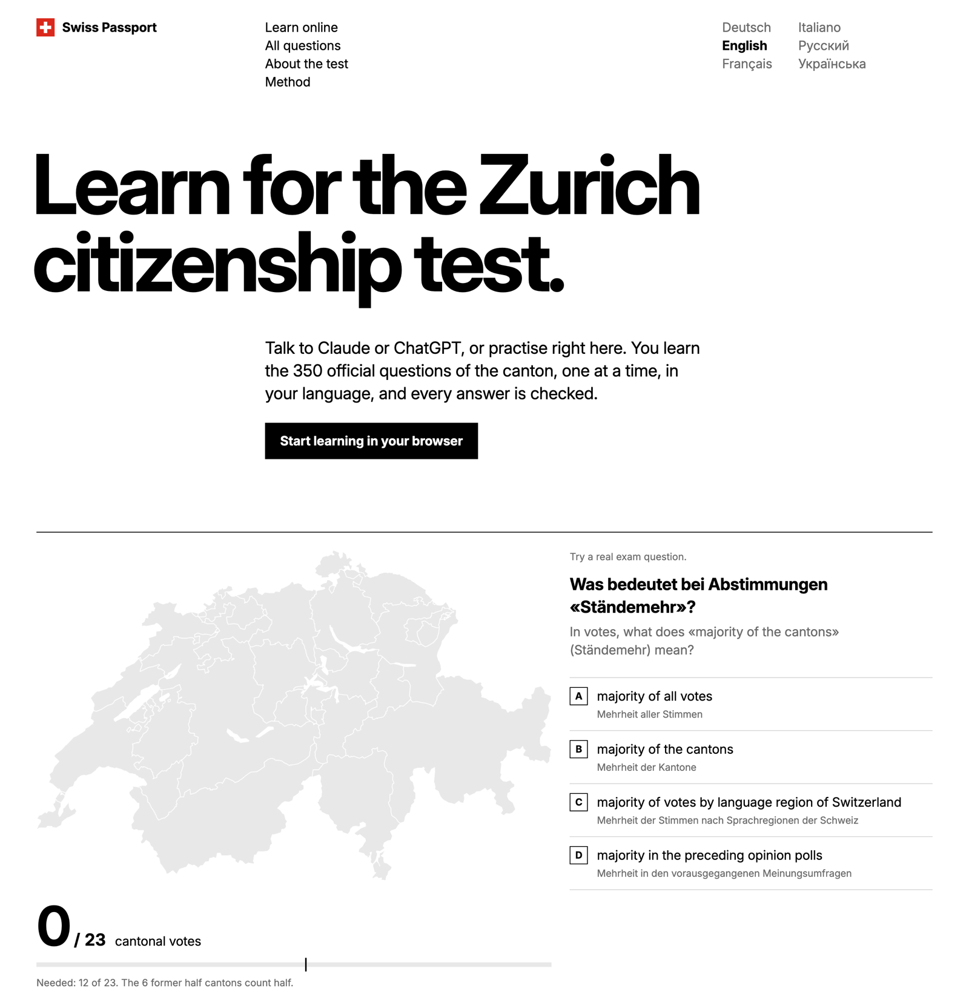

<p align="center">
  <a href="https://swiss-passport.com"></a>
</p>

<h1 align="center">Swiss Passport</h1>

<p align="center">
  <strong>Learn for the Zurich citizenship test.</strong><br>
  The 350 official questions of the knowledge test (Grundkenntnistest), one at a time, in your language.<br>
  In the browser, in Claude or in ChatGPT. Free, no account.
</p>

<p align="center">
  <a href="https://swiss-passport.com"></a>
  <a href="https://swiss-passport.com/learn/"></a>
  <a href="#claude"></a>
  <a href="#license"></a>
</p>

<p align="center">
  <a href="https://swiss-passport.com"></a>
</p>

<p align="center">
  <a href="https://swiss-passport.com/de/">Deutsch</a> &nbsp;
  <a href="https://swiss-passport.com/en/">English</a> &nbsp;
  <a href="https://swiss-passport.com/fr/">Français</a> &nbsp;
  <a href="https://swiss-passport.com/it/">Italiano</a> &nbsp;
  <a href="https://swiss-passport.com/ru/">Русский</a> &nbsp;
  <a href="https://swiss-passport.com/uk/">Українська</a> &nbsp;
  <a href="https://swiss-passport.com/es/">Español</a> &nbsp;
  <a href="https://swiss-passport.com/sq/">Shqip</a>
</p>

> [!NOTE]
> Not an official product of the Canton of Zurich. The questions come from the canton's official question list; the explanations were written for this project and checked against official sources.

## Start learning

Learn in the browser at [swiss-passport.com/learn](https://swiss-passport.com/learn/), or add Swiss Passport to an AI app. It is a remote MCP server, no account and no login:

```
https://swiss-passport.com/mcp
```

All ways share one learner code, so you can start in the browser and continue in an AI app. Step by step, in eight languages: [swiss-passport.com/en/connect](https://swiss-passport.com/en/connect/).

| App | Plans | Steps |
|---|---|---|
| **Claude** | Free and paid. Add on web or desktop, then also in the phone app and by voice. Quiz card. | Customize → Connectors → **+** → **Add custom connector**. Paste the address, **Add**, **Connect**. In a chat: **+** → Connectors → turn on Swiss Passport. |
| **ChatGPT** | Plus, Pro, Business, Enterprise, Edu. Web only. Quiz card. | **Plugins** → **Add** → **Create MCP App** (no Add button: turn on Developer mode in the settings first). Paste the address, *No Authentication*, **Create**. In a new chat type `@Swiss Passport`. After an update: Settings → Plugins → Swiss Passport → **Refresh tools**. |
| **Grok** | grok.com. Text only. | grok.com/connectors → **New Connector** → **Custom**. Paste the address. In a chat ask Grok to use Swiss Passport. |
| **Mistral Vibe (Le Chat)** | Free and paid, web. Text only. | Connectors → **Add Connector** → **Custom MCP Connector**. Name `SwissPassport`, paste the address, **Connect**. In a chat: **+** → Tools → turn it on. |
| **Perplexity** | Pro and Max, web. Text only. | Settings → Connectors → **+ Custom connector** → **Remote**. Authentication *None*, transport *Streamable HTTP*, **Add**. |

Any other app that can add a remote MCP server works the same way. The clickable quiz card (MCP Apps) shows in Claude and ChatGPT; elsewhere the assistant asks the questions as text.

### Your progress

On first use you get a learner code like `BERG-7K2Q`. Write it down and give it to the tutor in a new chat to continue where you left off. No account, no personal data.

### Claude Desktop, fully offline

Build the extension (`cd mcp && npm run pack`) and drag `mcp/swiss-passport-zh.mcpb` into Claude Desktop. Progress then stays on your computer in `~/.swiss-passport-quiz/`.

## How it teaches

The method follows [Execute Program](https://www.executeprogram.com/why-ep). The website explains it in detail, with the research behind it: [swiss-passport.com/en/method](https://swiss-passport.com/en/method/).

- **Short lessons.** 37 lessons in 7 units, from the basics (Switzerland at a glance, how the state works) to the canton and the municipalities. Each concept is explained briefly and practised right away.
- **One question at a time.** The server hands out exactly one step. The assistant never sees the next question in advance and never judges answers itself.
- **Repeat until correct.** A wrong answer comes back at the end of the same lesson or review until it is answered correctly.
- **Spaced reviews.** Every concept comes back after 1, 3, 7, 14 and 30 days. A mistake moves it back one level.
- **Pitfalls explained.** Every answer explains why it is right and why the tempting wrong options are wrong. Where the exam answer is outdated, a note gives today's facts while teaching the answer the exam expects.
- **Mock exam.** 50 random questions without feedback, like the canton's official practice test.
- **Exam language.** Learners study in their own language, but always see the German wording, because the real test is in German.
- **Voice.** In voice conversations, questions that need pictures are left out and answers can be spoken.

## What's inside

| | |
|---:|---|
| **350** | official questions of the Canton of Zurich |
| **37** | lessons in 7 units, from the basics to your municipality |
| **96** | topics, each explained in simple language |
| **8** | languages, always with the German original |
| **50** | questions per mock exam |

Every question, with its answer and explanation, is also on the website: [all questions](https://swiss-passport.com/en/questions/) and [about the test](https://swiss-passport.com/en/grundkenntnistest/).

Explanations were written in simple German (B1) using only official sources (the canton's and the city's learning brochures, admin.ch, ch.ch, zh.ch, the Historical Dictionary of Switzerland, fedlex) and translated into five languages. The translations are not official and would benefit from a review by native speakers. [Open an issue](https://github.com/AleksejDix/swiss-passport/issues) if you spot a mistake.

<details>
<summary><strong>Content files</strong></summary>

| File | What it holds |
|---|---|
| `quiz.json` | The 350 official questions: category, level, answer key, pictures. Language-neutral. |
| `curriculum.json` | Units → lessons → 96 concepts → questions, with official sources per concept. |
| `i18n/<lang>.json` | All text per language: questions, options, titles, concept explanations, key terms, answer explanations and notes. |
| `images/` | Pictures used by questions (flags, coats of arms, maps, photos), cut from the official PDF. |
| `sources/` | Links to the official documents and a summary of the exam rules. |
| `content/review_flags.md` | Open points for a human reviewer. |

</details>

## Development

<details>
<summary><strong>Build, test and deploy</strong></summary>

The repository is an npm workspace (monorepo) with three packages. Every push to `main` deploys swiss-passport.com through Cloudflare Workers Builds.

| Package | What it is |
|---|---|
| [`packages/engine/`](packages/engine/) | `@aleksejdix/learning-engine`: lessons with prerequisites, spaced reviews and mock exams, without content or dependencies. Published on GitHub Packages (tag `engine-v<version>`). |
| `mcp/` | The backend: the MCP server and the Cloudflare Worker that serves it at `/mcp` next to the website (TypeScript, Node 22+). |
| `site/` | The website (Astro). |

```sh
npm install         # once, in the repository root: installs all three packages
npm test -w @aleksejdix/learning-engine   # the engine's own tests
cd mcp
npm test            # builds and runs the local and HTTP end-to-end tests
npm run pack        # Claude Desktop extension (.mcpb)
npm run deploy      # Cloudflare by hand: website + /mcp Worker (progress in D1)
npm run dev:worker  # the same Worker locally on http://localhost:8787
npm run release     # self-hosting package for a Mac (Node + built-in SQLite, see deploy/install.sh)
```

Quality checks, from the repository root. GitHub Actions runs `check` and `test:e2e` on every push and pull request ([`.github/workflows/checks.yml`](.github/workflows/checks.yml)).

```sh
npx playwright install chromium   # once: the browser for the end-to-end tests
npm run check               # lint (ESLint, Stylelint), format (Prettier), types, content files, engine and server tests
npm run test:e2e            # the site in a browser against the real Worker: pages, links, /learn, CSP, accessibility
E2E_PORT=8791 npm run test:e2e   # another port, when a second checkout (git worktree) tests at the same time
npm run test:visual:update  # screenshots of the current site as the reference (before changing the look or the code)
npm run test:visual         # compares the site with the reference, pixel by pixel (phone, tablet, desktop)
```

| Where | What it checks |
|---|---|
| `stylelint.config.js` | The Swiss design in CSS: colours, type sizes and the typeface only from the tokens, two weights, no shadows, no rounded boxes, no all-caps text. |
| `tests/` | The content files fit together: every language has every text and placeholder, every question belongs to one topic, prerequisites have no cycles. |
| `e2e/` | Playwright against `wrangler dev` (static pages, `/mcp`, local D1, the production security headers). Every test also fails on a console error or a Content-Security-Policy violation. |
| `e2e/visual.spec.ts` | Visual regression on about 160 pages at three widths. The reference stays local (`e2e/__screenshots__/`, not committed): fonts render differently on each system. |

| Entry point | Transport | Progress stored in |
|---|---|---|
| `src/index.ts` | stdio (Claude Desktop extension) | a local JSON file |
| `src/worker.ts` | Streamable HTTP on Cloudflare Workers (swiss-passport.com) | Cloudflare D1, per learner code |
| `src/http.ts` | Streamable HTTP, self-hosted | SQLite (`node:sqlite`), per learner code |

The website (`site/`, Astro) is built into `mcp/public` and served by the same Worker as static files.

The learning engine and the content are kept apart:

| Path | What it does |
|---|---|
| `packages/engine/` | The learning engine: lessons, spaced reviews and mock exam. It holds no content: a catalog is passed in with `createEngine(catalog)`. |
| `mcp/src/learning/catalog.ts` | The Zurich catalog: the content files from the repository root, plus the exam name, the mock exam size and the pass mark. |
| `mcp/src/learning/` | The learning actions for one learner (learner code, progress, lessons, answers), shared by the MCP tools and the REST API. |
| `mcp/src/store/` | Where progress is kept: a local file, Cloudflare D1 or SQLite. |
| `mcp/src/mcp/` | The MCP tools, the tutoring instructions and the quiz card resource. |
| `mcp/src/api/` | The REST API `/api/v1` for the website and the mobile apps: [mcp/API.md](mcp/API.md). |
| `mcp/src/guard.ts` | Limits per client on new learner codes and wrong learner codes, for both the MCP tools and the REST API. |
| `mcp/src/view/` | The quiz card shown in the chat ([MCP Apps](https://blog.modelcontextprotocol.io/posts/2026-01-26-mcp-apps/)). |

Another course with four-option questions can reuse the engine with its own catalog: see [packages/engine/README.md](packages/engine/README.md).

</details>

## License

Free for personal learning and for non-profit use (e.g. charities, integration courses run by non-profits, public schools and authorities). **Commercial use is not allowed** without permission.

- Code: [PolyForm Noncommercial 1.0.0](LICENSE)
- Content written for this project (curriculum, explanations, translations): [CC BY-NC-SA 4.0](LICENSE-CONTENT.md)
- The official questions are published by the Canton of Zurich; see [sources](sources/README.md).

This is a source-available project, not open source in the OSI sense, because commercial use is excluded.
